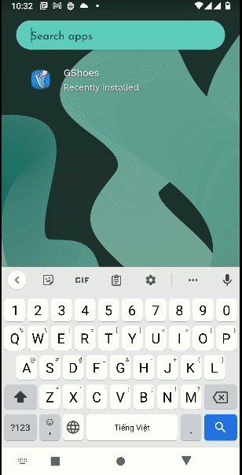

# GoldenOwlAsia
## webdev-intern-assignment

GShoes project on Android.

 

## Environment
- IntelliJ IDEA 2022.1 (Community Edition)
- Android 11

## Dependencies
- com.aurelhubert:ahbottomnavigation:2.3.4
- com.squareup.picasso:picasso:2.71828

## How it work?
- This project uses **PageViewer** to display 2 Fragment in slides: _ShopFragment_ and _CartFragment_
- **ViewModel** is used to communicate between 2 Fragment, which holds 2 properties:
ShopRepo , CartRepo.
  - ShopRepo manages adding a product to cart. When a product deleted in cart, ShopRepo re-enable that product so it can be added to cart again.
  - CartRepo manages how to add, remove, delete a product in ListCartProduct. It also auto re-calculate the total price when any change applied.
- Use **SharedPreferences** to save and load user data.
- Use **RecyclerView** to display the products lists.
- Use **Picasso** to fetch the images, it is cache-suported which is suitable for RecyclerView.
- Add the **bottomNavigation** feature to display the current Fragment and the number of products in cart.
